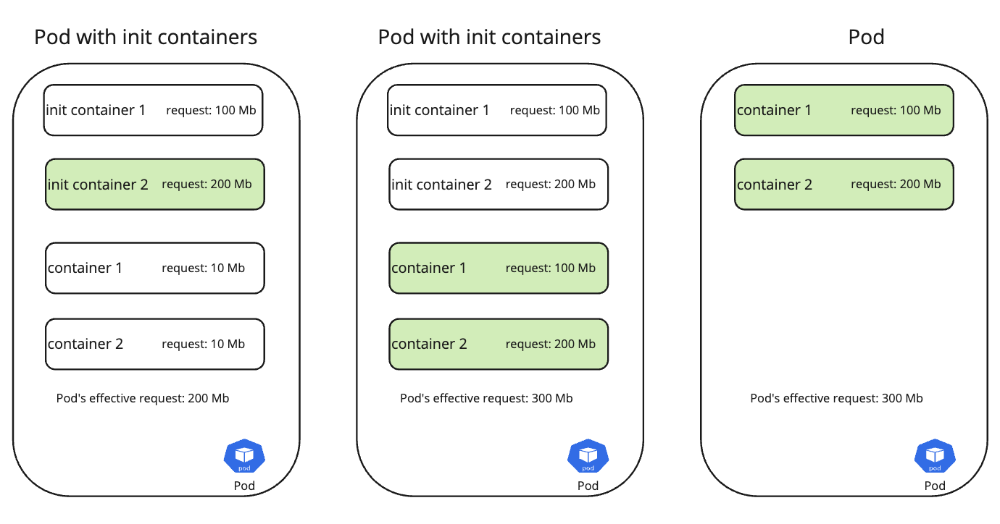

# RFC-7028 K8s Resource Allocation Philosophy

1. [Summary](#Summary)
2. [Pod’s Effective Resources](#pods-effective-resources)
3. [How are requests and limits used by Kubernetes](#how-are-requests-and-limits-used-by-kubernetes)
4. [Requests](#requests)
5. [Limits](#limits)
6. [Guidance](#guidance)
7. [Namespace Resource Quotas](#namespace-resource-quotas)
8. [Additional Resources](#additional-resources)

## Summary

When deploying containers within a pod, it is crucial to set requests and limits to safeguard shared
resources such as the nodes they operate on. This helps prevent the metaphoric Tragedy of the
Commons. Container requests and limits are easily misunderstood and have differing opinions across
the industry. The guidance outlined in the document is to help remove any ambiguity for applications 
and provide general guidance. There can and will be use cases that do not fit into the
general mold.

For a TL;DR go to Guidance

## Pod’s Effective Resources

A pod is the smallest deployable unit in Kubernetes. Which means a single pod can consist of multiple containers. Since resource constraints are set
at the container level, scheduling is determined based on a pod’s effective resource requests. Additionally, namespace quotas are applied based on
the pod's effective resources (requests and limits).

A pod’s effective resource request is calculated by:

If the pod has init containers defined, get the init container with the highest resource constraints
Sum all the non-init container’s resource constraints
The pod’s effective resource request is the higher of 1 and 2, which means init containers can reserve resources that are not used during the
life of the pod

### Examples:

**Note**: The above calculation is performed on a per resource constraint basis, i.e., memory and CPU are calculated separately
**Note2**: If a container defines a limit but not a request, the limit is used as the request.

### How are requests and limits used by Kubernetes

#### Requests

Kubernetes uses Pod resource requests to determine which nodes can support the required resources for scheduling. For instance, given two nodes
with 200Mb and 1Gb of memory, a pod that requires 500Mb of memory can only be scheduled on the 1Gb node.

Since a request is not a limit, a pod can use more resources than requested. Requests are comparable to the Java virtual machine’s Xms argument.
Although memory is used in the above example, the same is applied to all the resources, like CPU.

#### Limits

Kubernetes enforces the maximum resource that a container can use via limits. For memory, if a container tries to allocate more than its limit, the
container will be killed. The memory limit is comparable to the Java virtual machine’s Xmx argument.

For CPU, if the container tries to use more CPU than the limit, the kernel will not allow anymore CPU cycles for that period. Unlike memory, CPU is a
compressible resource, and the container will not be killed should it try to use more than the limit.

### Guidance

#### Container Request and Limits

Developers must understand their application’s resource requirement profile. There are many profiling tools (some built into IDEs) across each
language to help determine an initial base line for their DEV deployment. The most primitive example being task/activity monitor. Note, this profiling
can be done independent of running the software in a container.

After the DEV deployment, metrics should be used to ensure the resources set will suffice. The table below should be leveraged to determine request
and limits for memory and CPU.

| Resource | Request                                               | Limit                                                                    |
|----------|-------------------------------------------------------|--------------------------------------------------------------------------|
| Memory   | 50th percentile of usage                              | Peak usage + 25% buffer  If using > 10 Gb, consider a smaller buffer |
| CPU      | 30th percentile of usage or 1m, which ever is higher. | Peak usage                                                               |

As noted above, a container can use more than what it requested. While the CPU request may seem low, that will allow nodes to be densely packed.

#### Namespace Resource Quotas

Resource quotas are like container resource constraints. They are defined at the namespace level and set limits on the number of resources
consumed by a single namespace. Namespace resource quotas include number of pods and data storage in addition to CPU and memory.
Additionally, they are used to reserve capacity for a tenant (team/app/product) and prevent a single tenant from using all the cluster resources.

Once a resource quota is defined for a namespace, all containers in the namespace must have resource constraints set.

1. Calculate the aggregated resources needed for all the pods in the namespace.
    * Add buffer
    * Account for rolling upgrades. E.g., the older version of a pod is still running while the new one becomes ready
2. Account for organic capacity growth
3. When adding new service(s) to an existing namespace ensure the namespace quota is reviewed to account for both the service and the
additional resource requirements (sidecar, init containers et al.)

## Additional Resources
1. https://kubernetes.io/docs/concepts/configuration/manage-resources-containers/
2. https://kubernetes.io/docs/concepts/workloads/pods/init-containers/
3. https://kubernetes.io/docs/concepts/scheduling-eviction/node-pressure-eviction/#pod-selection-for-kubelet-eviction
4. https://kubernetes.io/docs/concepts/policy/resource-quotas/

